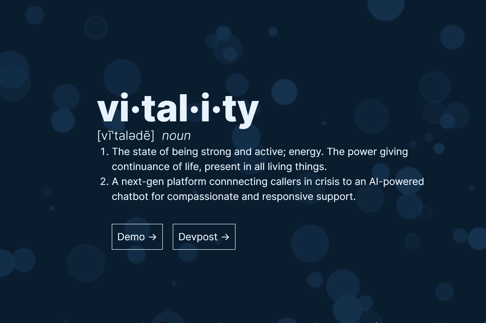

<p align="center">

  <a href="https://github.com/vitalityAI/office">
    
  </a>

  <h1 align="center">vitality.</h1>

</p>

<div align="center">


</div>

---

**Winning project of HackTJ 10.0**, _vitality_ is a next-gen platform connnecting callers in crisis to an AI-powered chatbot for compassionate and responsive support built by [Rushil Umaretiya](https:/crucialnet.org) and [Alvan Caleb Arlandu](https://arulandu.com/).

[`video demo`](https://www.youtube.com/watch?v=ZW48QwsxJvo)
[`backend`](https://github.com/vitalityAI/therapist)

## Inspiration

Humans today face so much turmoil, and they do so at lightspeed with modern technology. Relationships move in the blink of an eye; how can we be so connected and yet so alone simultaneously? The Suicide Prevention Hotline is a resource for anyone who is contemplating self-harm or just needs someone to talk to. With such a vital resource, how is it acceptable that a sixth of all callers hang up because they're stuck listening to hold music while they wait for an operator? [(source)](https://www.wsj.com/story/15-million-calls-to-suicide-hotline-were-abandoned-before-they-were-answered-786860d7)

## What it does

**vitality** will connect users to an AI language model trained on mental health resources and specifically prompt-engineered to provide concise and inquisitive responses while the caller waits for the next available operator. **vitality** then provides a chat log and AI-generated summary of its conversation with the caller so that operators can pick up the dialogue exactly where it stopped. The entire workflow is effortlessly seamless, such that the caller always has something or someone to listen.

## How we built it

Leveraging Twilio's Calling and VoiceResponse API on an Express.js server, we can pick up and respond to all incoming calls and track their status and logs with Prisma and MongoDB.

```javascript
const gather = twiml.gather({
  action: "/call/respond",
  method: "POST",
  input: "speech",
  language: "en-US",
  speechTimeout: "auto",
  model: "experimental_conversations",
});
```

```javascript
model Session {
  id String @id @default(auto()) @map("_id") @db.ObjectId

  startedAt DateTime @default(now())
  transferedAt DateTime?
  endedAt DateTime?

  callId String @unique
  callerPhone String

  summary String?

  operatorPhone String?
  operator Operator? @relation(fields: [operatorPhone], references: [phoneNumber])

  messages Message[]
}
```

Using TwiML, we can use AWS Polly's voice transcription model to generate an accurate record of what the user asks the service. Sending that data along with additional mental health resources to OpenAI's latest `gpt-3.5-turbo` model, we're able to generate viable responses that are then played back to the user.

```javascript
export const summarize = async (sessionId) => {
  const context = [
    {
      role: "system",
      content:
        "This is a conversation between you and someone calling the suicide prevention hotline. Please summarize the main issues that the caller is facing and highlight important points in the conversation. Keep your summary short.",
    },
  ];
....
```

On the operator's end, we provide a React-based frontend view where they can see all active callers, generate a summary of call logs, and transfer the calls to their own devices. The React frontend is well integrated with our Express.js API to ensure no calls are dropped at any point, and all data is thoroughly detailed and logged to provide the best transparency.

## Challenges we ran into

As you can see, the myriad of services that we brought together requires that data need to be extensively processed to make information compatible with Twilio, OpenAI, AWS, and Prisma. We spent the first 5 hours of the hackathon honing in only 200 lines of code, but that hard work was the glue that brought the entire project together. Plowing through page after page of deprecated documentation and confusing APIs taught us a lot about data abstraction and working with audio streams.

## Accomplishments that we're proud of

A working demo! In 24 hours, just two of us could bring together a project we were told would be impossible. By the submission deadline, we were able to successfully design the entire workflow from dialing the number to getting real help, and make it look good too! The demo really showed us the viability of the design, and we're excited to see where this thing goes.

## What we learned

In-person hackathons are amazing. We spent much time glued to our chairs typing away at our laptop keyboards, but the environment around us was surreal. It was crazy seeing all these coders actually in-person all in one place for the entire 24 hours (both of our first full hackathons IRL). Whether running around scrounging for snacks at 2 AM or seeing the immense variety in talent and niches, our experience at HackTJ is one for the books.

## What's next for vitality

Sky's the limit. The thing about our design is that the application we put it to is one of millions of ways this tech stack could be used. Tweaking the prompt by just a few sentences could automatically route calls to an insurance company, gather vital information when emergency responders are at capacity, or provide worldwide access to health resources at the dial of a number. There are so many ways to put this project to use, and we're excited to see what the future holds.

<pre>- rushil & caleb</pre>
